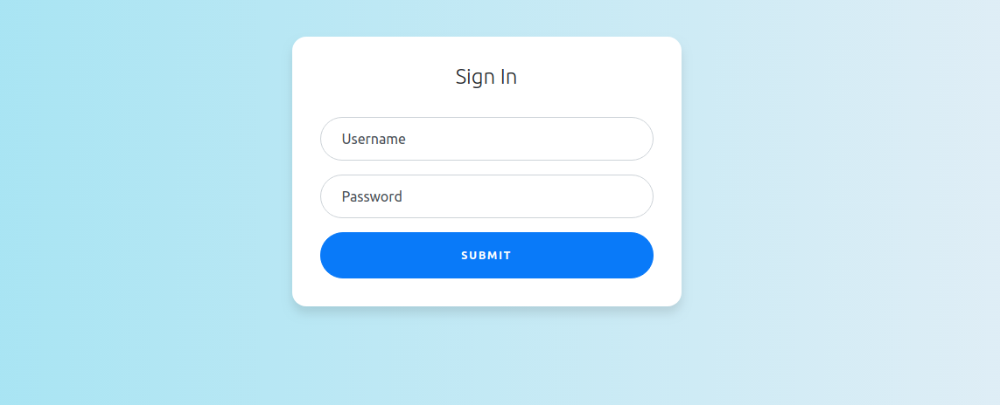

# Team apps login page

## Team apps

Team apps category is a set of applications that all share the same authentication server.
The applications in the team apps category are simple applications that are to be used by a team in their office.
The applications can be various and are solely developed for fun amongst the team.

First app I've developed is a simple milk management app. It's focus is to manage who buys milk for coffe in the office :). You can check it out here:

- Milk service (Backend):
- Milk front end:

## The project

This is a simple react project that provides an login page, to be used by an authentication server.

## Purpose

- Provide a simple login that can be used by the authentication server developed for the team apps.
- Play around with react and build a simple react component
- Play around with bash scripts and automate the instalation of the login page project as a maven artifact.

## How to use

- The app was created using `create-react-app`.
- To run it locally simply use `npm start`. The app should now run on `localhost:3000`

## Install as a maven artifact

Because the login page was aimed to be used by the authentication server developed with `java & spring boot`, it is used by the authentication server as a maven dependency. You can check out the authentication server developed for the team apps here : https://github.com/Slidem/team-apps-oauth2-server

To install the login page static resources (the actual .html file, the css and js files that are bundled after an npm build) simply run the `build-maven-artifact.sh` script. This will pack the static resources into a zip file and install the zip file as a maven artifact into your local repository.
